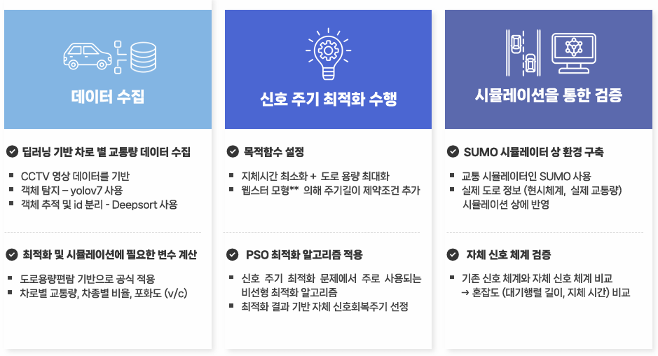

# EVP-Signal-Recovery-Optimization
Optimization of Signal Recovery Cycle in Emergency Vehicle Priority Signal System for Minimizing Traffic Congestion

### 대한산업공학회 제20회 한국대학생“산업공학”프로젝트경진대회 은상🥈 수상 

# 2024-1 동국대 산업시스템공학종합설계 10조

## Team Members
| 이름 | 학번 |
| --- | --- |
| 김태경 | 2021112387 |
| 류채린 | 2021112385 |
| 심차현 | 2021112413 |
| 이상준 | 2019112445 |
| 주예서 | 2021112443 |

## Team Subject
### 교통 혼잡 최소화를 위한 긴급차량 우선신호 시스템 상의 신호 회복주기 최적화 

#### - 강남 테헤란로를 중심으로

### 연구배경
EVPs (긴급차량 우선 신호 시스템) 적용 직후, 갑작스러운 기존 신호 체계 변경으로 인한 일반 차량들에 대한 교통 혼잡 발생 해결

### 방법론

#### 1. 데이터 수집
- 딥러닝 기반 차로별 교통량 데이터 수집
- 도로교통편람 프로그램으로 v/c 계산을 통한 혼잡도 입증

#### 2. 신호 주기 최적화 수행
- 목적함수 설정
- PSO 최적화 알고리즘 적용

#### 3. 시뮬레이션을 통한 검증
- SUMO 시뮬레이터 상 환경 구축
- 자체 신호 체계 검증

## Repository

AI_traffic_estimation

[https://github.com/DGU-ISEmergency/AI_traffic_estimation]

Algorithms

[https://github.com/DGU-ISEmergency/Algorithms]
